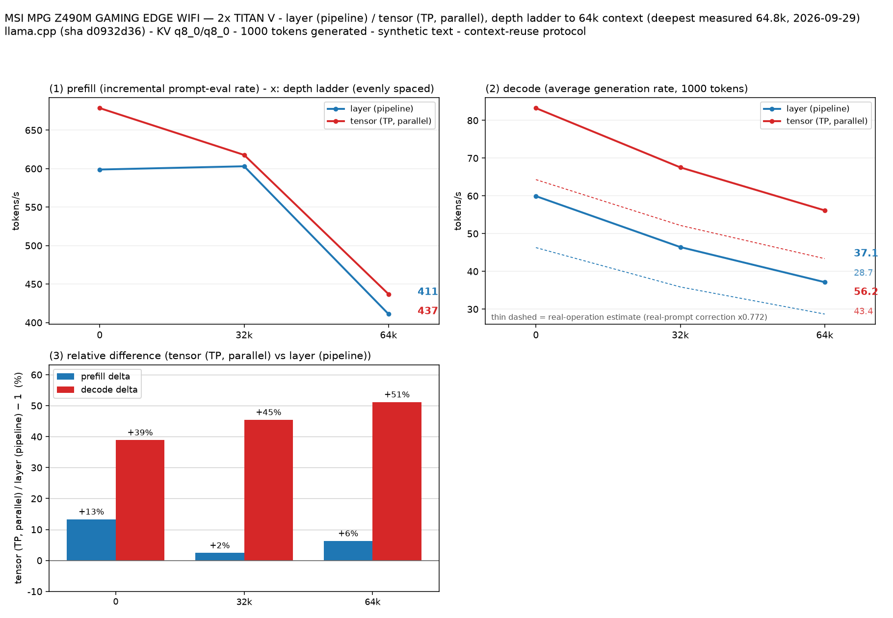

# TITAN V 2枚でQwen3.8 27B IQ4_XSのsplit-modeを64Kまで比較

- **作成者**: tomo_9180
- **作成日**: 2026-09-29

## 概要

TITAN V 12GBを2枚使い、Qwen3.8 27B UD-IQ4_XSのlayer / tensor分割を64Kコンテキストまで各1回測定した。
64K段ではtensor分割がlayer分割よりprefillで約6%、decodeで約51%速かった。128K設定はVRAM不足で完走できなかったため、結果には含めていない。

## ハードウェア

| 項目 | 内容 |
|------|------|
| コンピュータ / マザーボード | MSI MPG Z490M GAMING EDGE WIFI (MS-7C76) |
| GPU | NVIDIA TITAN V 12 GiB × 2 |
| GPU接続 | PCIe 3.0、現在のリンク幅 x8 / GPU（最大 x16）。GPU間はPHB経由、NVLinkなし |
| CPU | Intel Core i9-10850K、10コア / 20スレッド |
| メモリ | OS認識 61 GiB、種類は不明 |

## ソフトウェア環境

| 項目 | 内容 |
|------|------|
| OS | Ubuntu 26.04.1 LTS / Linux 7.0.0-30-generic |
| GPUドライバ | NVIDIA 580.178.04 |
| llama.cpp | llama-prism 0.2.0-dev、build 1、commit 1a07bfa、CUDAバックエンド |

## ベンチマーク

### 条件

| 項目 | 内容 |
|------|------|
| ツール | llama-split-bench 7af72d4 |
| モデル | Qwen3.8-27B-UD-IQ4_XS.gguf、14,252,845,984 bytes（約13.28 GiB） |
| 測定モード | layer / tensor（CUDA0, CUDA1）。単一GPUはモデルが12 GiBに収まらず測定対象外 |
| ctx / stages | 65,536 / 0, 32,000, 64,000（実入力深度は後述） |
| KVキャッシュ | K=q8_0、V=q8_0 |
| 投機的デコード | MTP、最大ドラフト長2 |
| 実用プロンプト補正 | tensorで3種類を計測。補正係数0.772（図の推定線に使用） |
| 推論設定 | Flash Attention有効、GPU offload=all、parallel=1、CPU threads=8 |
| 反復 | 各モード1回 |

128Kの試行では、layer分割の32K段でGPUメモリ不足が発生した。64Kに下げて再実行し、全段を完了した。

### 深度別のprefill / decode

単位はtok/s。各条件1回の測定値。

| 実入力depth | prefill layer | prefill tensor | decode layer | decode tensor |
|---:|---:|---:|---:|---:|
| 0 ※ | 598.8 | 678.6 | 59.94 | 83.26 |
| 32,093 | 603.1 | 617.8 | 46.44 | 67.55 |
| 64,806 | 411.1 | 437.0 | 37.14 | 56.16 |

※ depth 0のprefillは新規1,978トークン入力（pp2048）の値。decodeはラダー初段の11トークン入力による値なので、短い入力での参考値として扱う。ラダー初段のprefillは計測上のartifactのため表に載せていない。

### 新規入力のprefill

各入力はキャッシュなしで計測した。単位はtok/s。

| 目標入力長 | 実入力長 | layer | tensor |
|---:|---:|---:|---:|
| 512 | 512 | 491.0 | 630.1 |
| 2,048 | 1,978 | 598.8 | 678.6 |
| 8,192 | 8,077 | 653.4 | 699.3 |

### 所感

- tensor分割は全ての測定深度でlayer分割より速かった。64K段ではprefillが約6%速く、decodeが約51%速かった。
- 深度が増えると両方式の速度は下がった。64K段のprefillはlayerが411.1 tok/s、tensorが437.0 tok/s、decodeはそれぞれ37.14 tok/s、56.16 tok/sだった。
- この結果は各方式1回の測定で、繰り返しによるばらつきは評価していない。単一GPUはVRAM容量の制約で比較していない。

## 添付

- [run-info.json](attachment/2026-09-29_141725_comparing_qwen3_8_27b_iq4_xs_split_modes_on_2x_titan_v_at_64k_context/run-info.json)
- [layer起動引数](attachment/2026-09-29_141725_comparing_qwen3_8_27b_iq4_xs_split_modes_on_2x_titan_v_at_64k_context/argv-layer.txt)
- [tensor起動引数](attachment/2026-09-29_141725_comparing_qwen3_8_27b_iq4_xs_split_modes_on_2x_titan_v_at_64k_context/argv-tensor.txt)
- [layer結果](attachment/2026-09-29_141725_comparing_qwen3_8_27b_iq4_xs_split_modes_on_2x_titan_v_at_64k_context/results-layer.json)、[layer新規入力](attachment/2026-09-29_141725_comparing_qwen3_8_27b_iq4_xs_split_modes_on_2x_titan_v_at_64k_context/results-layer-pp0.json)
- [tensor結果](attachment/2026-09-29_141725_comparing_qwen3_8_27b_iq4_xs_split_modes_on_2x_titan_v_at_64k_context/results-tensor.json)、[tensor新規入力](attachment/2026-09-29_141725_comparing_qwen3_8_27b_iq4_xs_split_modes_on_2x_titan_v_at_64k_context/results-tensor-pp0.json)
- [実用プロンプト結果](attachment/2026-09-29_141725_comparing_qwen3_8_27b_iq4_xs_split_modes_on_2x_titan_v_at_64k_context/results-real.json)
